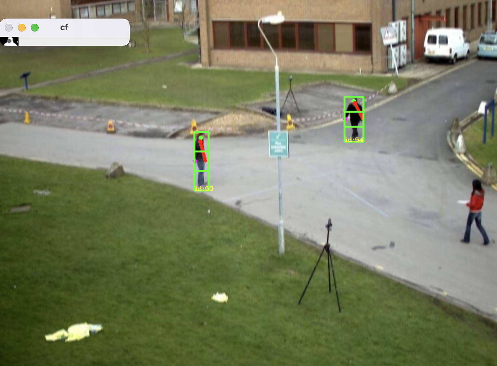

# violence detection w/ computer vision 

## Why
I am working on this project as my *TIPE* for the french *"Concours aux grandes écoles d'ingénieur"*.  
The aim of the project is to suggest an algorithm able to detect violent behaviors.  

## Requirements
The video input must have a fixed background with the least as possible moving objects (except pedestrians).  
The detection is based on motion detection with background substraction.  
In order to track people I am using a kalman filter.  
The algorithm is not able to detect dangereous behaviors yet.

The red line is an estimation of the orientation of the arm, the pink dot is an estimation of the position of the hand.  
The green got is the position of the head.  
As you can see the detector is not perfect as the lady on the right is not detected
